# Open Contracting Data Analysis for Corruption Risk Detection

This project analyzes open contracting data to identify potential corruption risks in public procurement processes.

## Project Overview

- **Data Processing**: Ingested, cleaned, and transformed open contracting data (JSON) into a Lakehouse and Warehouse environment.
- **Risk Scoring**: Calculated corruption risk scores for factors like single-bid contracts, repeated awards, short tendering periods, and unusual price variations.
- **Power BI Reporting**: Created interactive dashboards for visualizing corruption risk indicators.
- **Technologies Used**: Microsoft Fabric, Power BI, JSON, Data Lakehouse/Warehousing.

## Key Visualizations

Here are the key visualizations from our analysis:

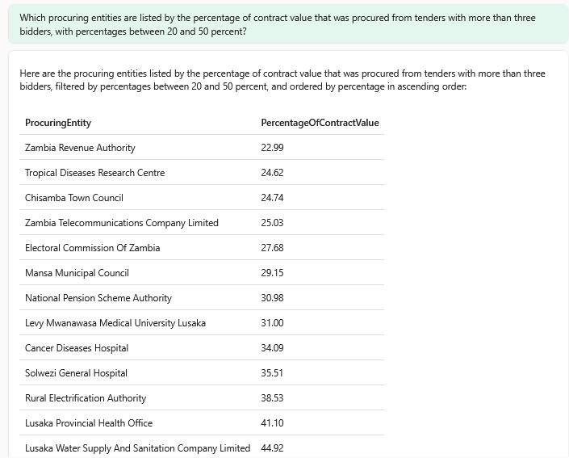

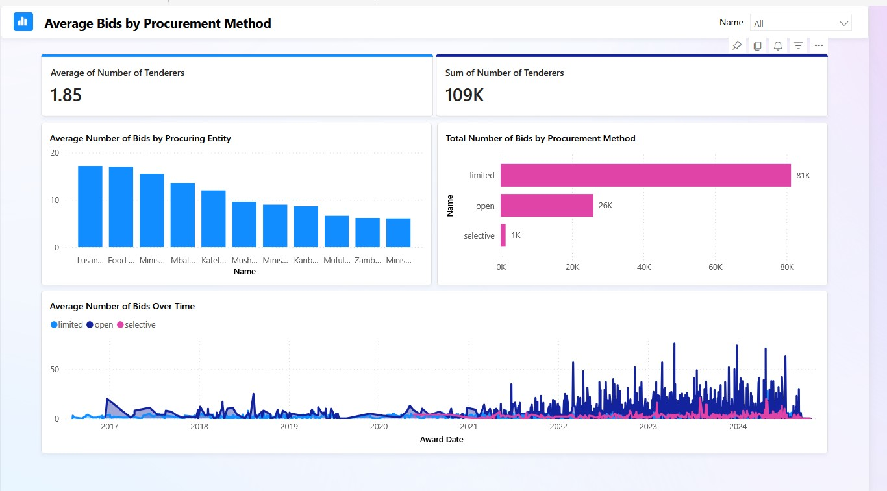

*Average bid amounts across different procurement methods*

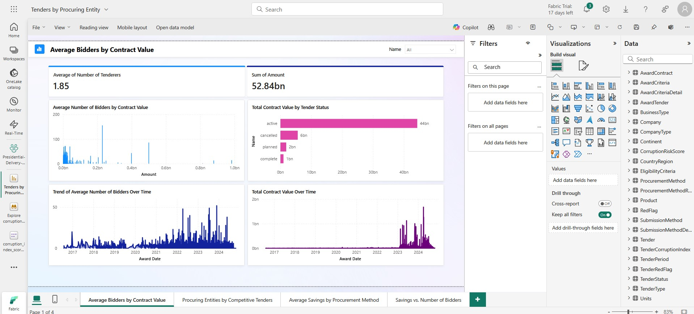

*Relationship between contract value and number of bidders*

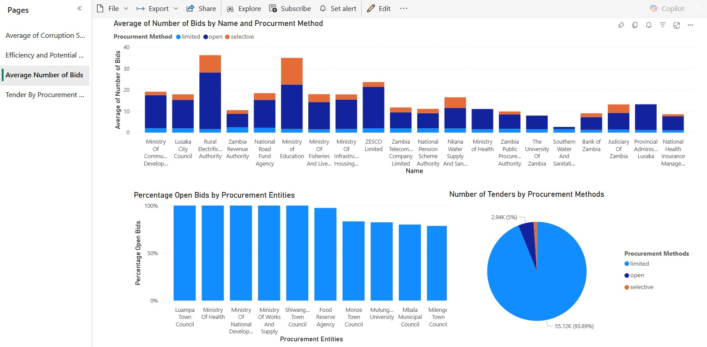
*Distribution of bids received per contract*

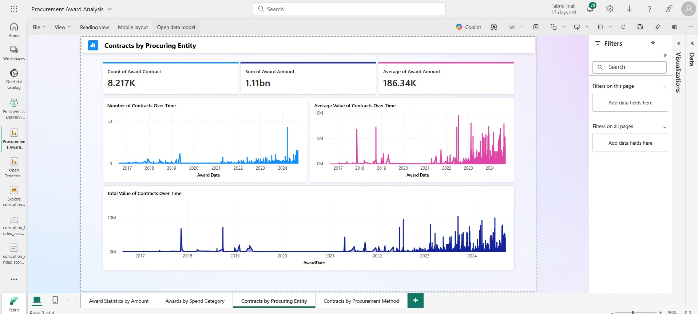

*Volume of contracts awarded by different procuring entities*

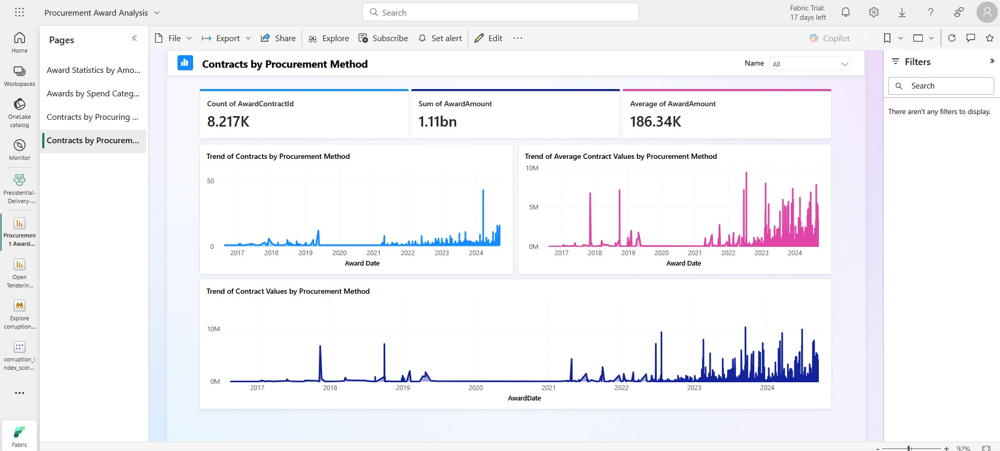

*Breakdown of contracts by procurement type*

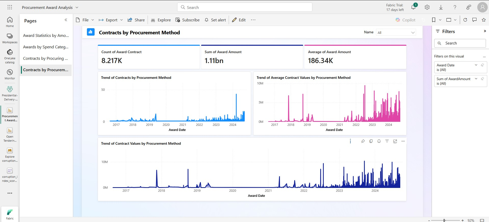

*Detailed view of procurement methods used*

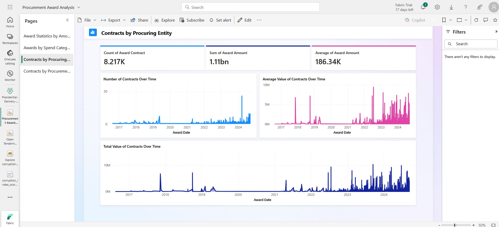

*Contract distribution for specific entities of interest*

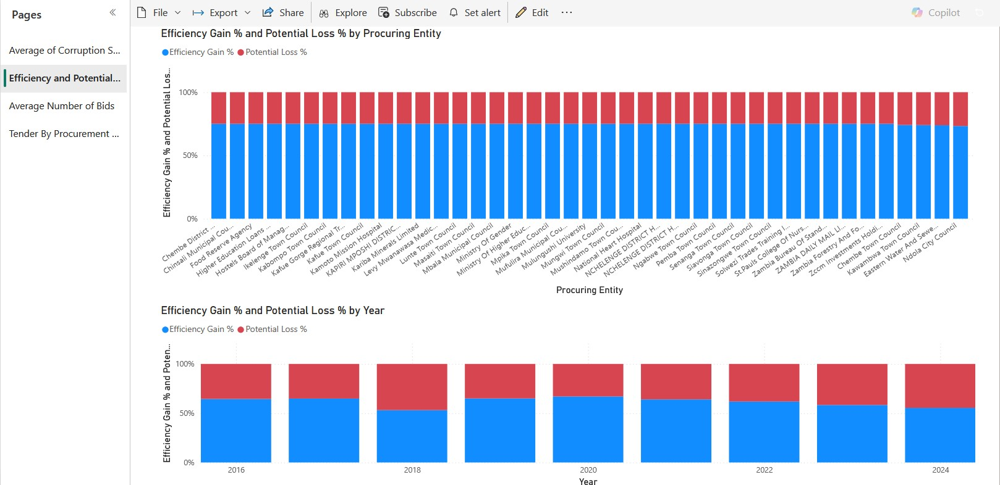

*Analysis of procurement efficiency and potential financial losses*

*Analysis of Average Score by Procurement Entity and Year*

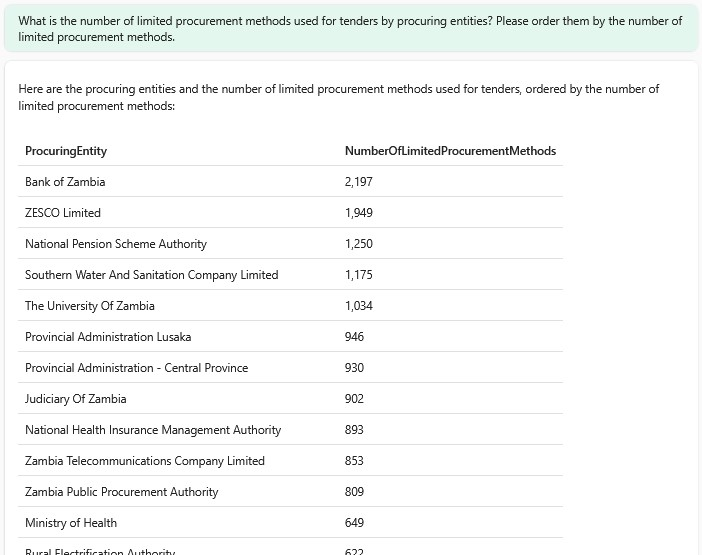

*Prevalence of limited/non-competitive procurement methods*

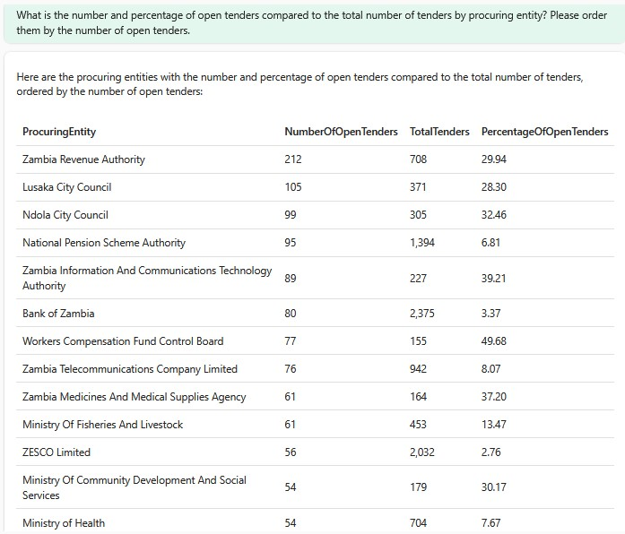

*Percentage of contracts awarded through open tendering*

## Getting Started

To replicate this analysis:
1. Set up a Microsoft Fabric environment
2. Ingest JSON contracting data into a Lakehouse
3. Transform the data using the provided scripts
4. Connect Power BI to the processed data
5. Use the dashboard templates to visualize the results
